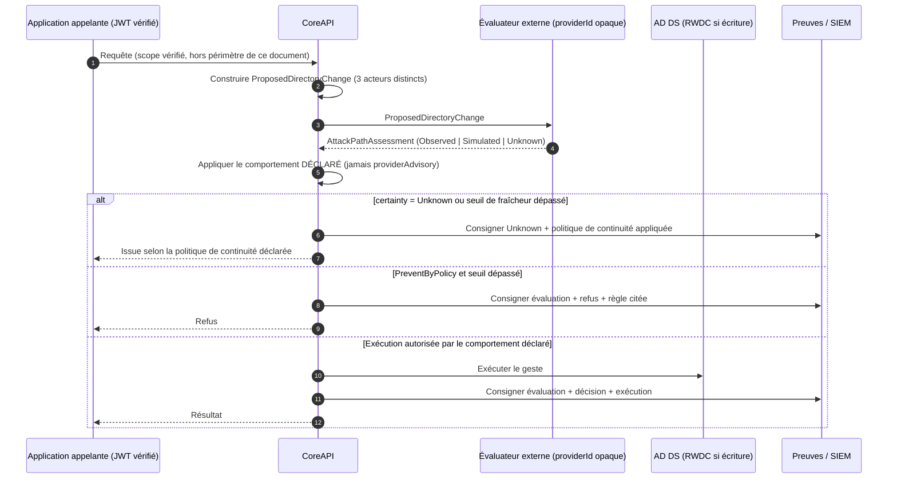
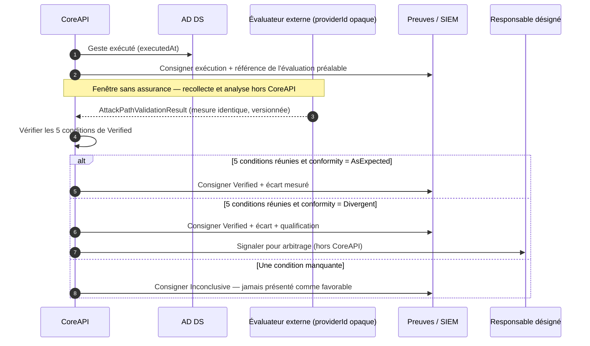

# Vue d'intégration — protection des chemins d'attaque (contrats futurs)

*Document créé le 2026-07-22, corrigé le 2026-07-22 (mêmes décisions de session). **Statut : proposé,
non implémenté, non décidé.** Aucun code correspondant n'existe dans `src/CoreApi/`. Ce document
définit des **contrats d'intégration futurs** et la position de CoreAPI vis-à-vis d'eux. Il n'engage
aucun incrément et n'élargit aucun périmètre existant.*

*Ce document ne duplique pas le modèle conceptuel de la dimension `AttackPathProtection` (capacités,
comportements décisionnels, limite d'assurance, contrôles `ADDS-AP-*`), qui vit dans le corpus de
gouvernance AD DS transverse, hors de ce dépôt. Il n'en reprend que ce dont un contrat de CoreAPI a
strictement besoin.*

---

## 1. Position de CoreAPI

CoreAPI est un **point d'application de la politique**, pas un moteur de décision de risque
(`authorization-model.md` §1). Cette posture s'étend sans exception à la protection des chemins
d'attaque :

| CoreAPI fait | CoreAPI ne fait pas |
| --- | --- |
| Exprimer un changement proposé sous une forme normalisée et vérifiable | Décider si un changement est acceptable |
| Consommer un résultat d'évaluation produit ailleurs | Produire l'analyse du graphe d'identité |
| Appliquer le comportement décisionnel **déclaré par l'organisation** | Choisir lui-même d'informer, d'exiger une approbation ou de bloquer |
| Consigner l'évaluation et la décision comme preuve | Conserver une copie du graphe d'identité |
| Rester agnostique du fournisseur | Coder une intégration à un produit d'analyse particulier |

**Conséquence directe** : aucun nom de fournisseur n'apparaît dans les contrats. L'évaluateur est
désigné par un `providerId` **opaque**, résolu au déploiement, et par un `providerKind` générique
(`Internal` / `External`). L'énumération des fournisseurs éventuellement retenus vit dans les
documents d'adoption de l'organisation, jamais dans ce dépôt.

**Simulation exclue du cœur.** La construction d'un delta de graphe hypothétique n'appartient pas à
CoreAPI. CoreAPI peut *consommer* un résultat portant le niveau de certitude `Simulated` ; il ne le
produit jamais.

---

## 2. Ce que CoreAPI ne saura jamais garantir seul

Distinction obligatoire, reprise ici parce qu'elle conditionne la forme des contrats :

| | Analyse de l'état actuel | Simulation d'un delta | Validation après exécution |
| --- | --- | --- | --- |
| Capacité correspondante | `CurrentStateAssessment` | `ProposedChangeSimulation` | `PostChangeValidation` |
| Répond à | l'exposition existante aujourd'hui | l'exposition si le geste était appliqué | l'exposition réellement constatée après |
| Certitude portée | `Observed` | `Simulated` | `Verified` |
| CoreAPI peut le produire ? | non — il l'obtient | **non, jamais** | non — il l'obtient après recollecte |

Un résultat `Observed` renvoyé par un évaluateur **n'est pas une preuve de l'état futur**. Aucun
message, aucune réponse d'API, aucun journal produit par CoreAPI ne doit le présenter comme tel.

Trois conséquences directes, désormais **encodées dans les schémas** et non plus seulement écrites :

- `AttackPathAssessment.certainty` n'accepte que `Observed`, `Simulated` ou `Unknown`. `Verified` en
  est **absent** : une évaluation précède l'exécution, elle ne peut pas constater un état
  post-exécution.
- Un résultat `Simulated` exige un état **observé de départ** (`observedBaselineRef`), une version de
  modèle, et la liste des types de relations que ce modèle sait calculer. Une simulation ne prouve
  jamais l'absence de chemin ; ce champ rend la limite exploitable au lieu de la laisser en note.
- `Unknown` est un résultat légitime et fréquent. **Il n'est jamais interprété comme favorable.** Son
  traitement suit la politique de continuité déclarée par l'organisation, pas une décision de CoreAPI.

---

## 3. Les trois contrats

Schémas JSON : [`../contracts/`](../contracts/).

| Contrat | Sens | Producteur | Consommateur |
| --- | --- | --- | --- |
| `ProposedDirectoryChange` | Description normalisée d'un geste **envisagé**, avant toute exécution | CoreAPI | Évaluateur externe |
| `AttackPathAssessment` | Résultat d'évaluation d'un changement proposé | Évaluateur externe | CoreAPI |
| `AttackPathValidationResult` | Constat après exécution, recollecte et nouvelle analyse | Évaluateur externe | CoreAPI |

### 3.1 `ProposedDirectoryChange` — trois acteurs, jamais confondus

Un changement proposé, **jamais** un changement appliqué.

La correction structurante de ce contrat est la séparation de trois acteurs que le modèle initial
avait fusionnés en un seul bloc :

| Bloc | Contenu | Vérifié par CoreAPI |
| --- | --- | --- |
| `callingApplication` | L'application appelante, identifiée par son `client_id`. **Toujours une application** : CoreAPI n'accepte que `client_credentials`, jamais un flux délégué ni une identité humaine en bout de chaîne. | **Oui**, à chaque appel |
| `originatingActor` | L'acteur métier à l'origine de la demande, situé sur un segment amont que CoreAPI ne voit pas. Porte `assertedBy` et `verificationLevel`. | **Non** — présence et intégrité de l'assertion seulement |
| `proposedBy` | L'origine de la **proposition** : `Human`, `Automation` ou `AiAssisted`, avec une référence de proposition. | Oui, comme donnée |

`verificationLevel` (`Verified` / `AssertedNotVerified` / `Absent`) est le champ critique. Sans lui,
une assertion amont non vérifiée finirait présentée comme un fait dans la trace d'audit — exactement
la fausse assurance que le reste du modèle combat. CoreAPI ne rejoue jamais le processus métier qui a
produit l'assertion ; il constate son niveau de vérification et le consigne tel quel.

`proposedBy.origin = AiAssisted` exige une `proposalRef` : sans elle, l'origine n'est pas traçable et
le contrôle `ADDS-AP-005` n'est pas vérifiable.

### Frontière actuelle de l'IA vis-à-vis de CoreAPI

> **Toute écriture directe ou indirecte dans AD DS par une IA est non développée, non planifiée, non
> souhaitée et absente de la roadmap actuelle.**

Une proposition d'origine IA entre dans CoreAPI comme une **donnée**, jamais comme un appelant. Elle
traverse le contrôle d'autorisation normal, sans allègement et sans chemin dédié.

Concrètement, vis-à-vis de CoreAPI, une IA :

- ne détient jamais une identité ni un secret d'écriture AD ;
- ne peut pas emprunter, déclencher ni piloter l'identité d'exécution de CoreAPI — les profils
  d'exécution internes (`authorization-model.md` §11) lui sont inaccessibles ;
- ne peut pas appeler un point d'accès exécutoire de CoreAPI ;
- ne transforme jamais elle-même une proposition en geste ;
- produit uniquement une proposition structurée non exécutoire ;
- transmet cette proposition à un acteur ou à un workflow habilité ;
- reste séparée par processus et par credential du moteur d'exécution.

**Rien n'est prévu pour lever cette frontière.** Aucun mode `AutonomousExecution`, aucun indicateur
de fonctionnalité, aucune capacité désactivée, aucun élément de roadmap ne prévoit une écriture par
l'IA — ni dans ce document, ni dans
[`../../specifications/security/sec-06-attack-path-protection.md`](../../specifications/security/sec-06-attack-path-protection.md),
ni ailleurs dans `docs/`. Il n'y a rien à activer. **Toute évolution future exigerait une nouvelle
décision d'architecture explicite**, consignée dans
[`../../adr/decisions-log.md`](../../adr/decisions-log.md) ; elle ne peut résulter ni d'une
configuration, ni d'un incrément de code, ni d'une interprétation du présent document.

Le champ `writeIntent` déclare si le geste modifie l'état de l'annuaire. Lorsqu'il vaut `true`,
l'opération exige un contrôleur de domaine inscriptible sain : une capacité d'écriture sans RWDC
disponible est une **incompatibilité structurelle**, pas un risque acceptable. Le choix effectif du
contrôleur reste une politique de déploiement, hors de ce contrat.

Ce contrat ne porte **aucun verdict**. Il ne contient ni score, ni décision, ni recommandation.

### 3.2 `AttackPathAssessment` — la capacité gouverne la certitude

`capability` est **obligatoire**, et détermine quelle certitude le résultat peut porter :

| `capability` | Certitudes admissibles | Répond à |
| --- | --- | --- |
| `CurrentStateAssessment` | `Observed`, `Unknown` | l'exposition **actuelle** autour de la cible |
| `ProposedChangeSimulation` | `Simulated`, `Unknown` | l'exposition **si** le geste était appliqué |

Un résultat `Observed` **ne dit rien de l'effet du changement**. Déterminer qu'un geste augmenterait
l'exposition exige `ProposedChangeSimulation` : sans cette capacité, CoreAPI ne peut pas affirmer que
l'effet futur a été évalué. Cette règle est encodée dans les deux sens — la capacité d'état actuel ne
peut pas produire `Simulated`, et réciproquement.

La **provenance est obligatoire** dès qu'une évaluation existe : `providerId` opaque et
`providerKind` générique (`Internal` / `External`). Aucun produit n'est nommé.

Trois régimes conditionnels :

- **`Observed`** exige `dataCollectedAt`, `exposureMeasure`, et une qualité de données réellement
  exploitable : `freshnessThresholdMet: true` **et** `targetCovered: true`. Une collecte trop ancienne
  ou une cible non couverte ne produit pas un `Observed` dégradé — elle produit `Unknown`.
- **`Simulated`** exige un état observé de départ (`observedBaselineRef`), la version du modèle, la
  liste des types de relations modélisés, et une mesure exploitable.
- **`Unknown`** n'exige **aucune mesure** et **en interdit une** : un résultat indéterminé ne porte
  pas de valeur numérique. Il porte à la place une raison structurée — `ProviderUnavailable`,
  `DataTooOld`, `PartialCollection`, `TargetNotCovered`, `ModelIncapable` ou `OtherDeclaredReason`
  (avec note obligatoire). Inventer une mesure pour un résultat indéterminé serait la pire forme de
  fausse assurance : un chiffre sans réalité derrière.

La `exposureMeasure` est **nommée, référencée et versionnée** (`measureName`, `measureDefinitionRef`,
`measureVersion`). Sans la version, un changement d'évaluateur ou de définition rendrait toute
comparaison avant/après silencieusement fausse — un artefact présenté comme un écart.

Le résultat peut porter des `findings` **agrégés**. Il ne porte **pas** les chemins détaillés (§5).

Le champ d'avis du fournisseur s'appelle `providerAdvisory`. **CoreAPI applique le comportement
déclaré dans le profil de l'organisation, jamais l'avis de l'évaluateur.** Une divergence entre les
deux est consignée, jamais arbitrée par CoreAPI.

### 3.3 `AttackPathValidationResult` — conditions de `Verified`, et qui les vérifie

Constat après exécution. `Verified` exige que **toutes** les conditions soient réunies. Elles ne sont
pas vérifiables par le même moyen, et cette répartition est structurante :

| # | Condition | Champ | Vérifié par |
| --- | --- | --- | --- |
| 1 | `assessmentRef` présent et non vide | `assessmentRef` | **JSON Schema** |
| 2 | Attestation de recollecte postérieure au geste | `recollectionAfterChange: true` | **JSON Schema** (l'attestation) |
| 3 | La cible est couverte, la collecte complète | `targetCovered: true`, `completeness: Complete` | **JSON Schema** |
| 4 | Attestation de comparabilité des mesures | `measuresComparable: true` | **JSON Schema** (l'attestation) |
| 5 | Mesures avant **et** après présentes | `measureBefore`, `measureAfter` | **JSON Schema** |
| 6 | La recollecte est **réellement** postérieure au geste | `dataCollectedAt` > `executedAt` | **validateur sémantique** |
| 7 | `revalidatedAt` est postérieur à `executedAt` | horodatages | **validateur sémantique** |
| 8 | Définition, version et nom de mesure **identiques** à l'évaluation préalable | `measureDefinitionRef`, `measureVersion`, `measureName` | **validateur sémantique** |
| 9 | `assessmentRef` résout vers une évaluation existante | — | **validateur sémantique** |

Si une seule manque, le résultat est `Inconclusive` ou `Unknown` — **jamais favorable**.

**Pourquoi des attestations booléennes ?** Les conditions 2 et 4 existent en double : une attestation
dans le document, et un contrôle sémantique qui la confronte à la réalité. C'est délibéré. JSON Schema
ne sait pas comparer deux dates ni lire un second document ; l'attestation rend la condition
**exprimable et opposable**, le validateur sémantique la rend **vraie**. Une attestation contredite
par les horodatages réels est une non-conformité en soi, plus grave qu'une attestation absente.

Le niveau `certainty` n'accepte que `Verified` ou `Unknown`. `Verified` + `Inconclusive` est refusé :
un constat vérifié a nécessairement produit une comparaison, donc `AsExpected` ou `Divergent`.
Symétriquement, `AsExpected` ou `Divergent` supposent `Verified`. Enfin, `Divergent` exige une
qualification non vide — une divergence non qualifiée n'est pas exploitable pour un arbitrage.

### 3.4 Ce que JSON Schema ne fait pas, et ne doit jamais être présenté comme faisant

| Contrôle | Nature | Assuré par |
| --- | --- | --- |
| Types, champs obligatoires, énumérations, forme | structure | **JSON Schema 2020-12** |
| « si ce champ vaut X, alors cet autre est requis/interdit » **dans un même objet** | cohérence conditionnelle | **JSON Schema 2020-12** |
| Comparer deux horodatages entre eux | chronologie | **validateur sémantique** |
| Comparer une valeur à celle d'un **autre** document ; résoudre une référence | croisé | **validateur sémantique** |

Les schémas de ce dépôt portent cette limite explicitement dans leurs `$comment`. Aucune
documentation, aucun critère d'acceptation et aucun rapport ne doit affirmer que les schémas
comparent des dates ou vérifient seuls l'identité de deux mesures situées dans deux documents.

---

## 4. Séquences vues depuis CoreAPI

Les séquences complètes du modèle vivent dans le corpus de gouvernance transverse. Les deux
diagrammes ci-dessous n'en montrent que **la part CoreAPI**, pour rendre visibles les frontières que
CoreAPI ne franchit pas.

### 4.1 Pré-changement

Frontière visible : CoreAPI **n'interroge pas le graphe**. Il envoie un changement proposé et reçoit
un résultat. Le remplacement de l'évaluateur ne change aucune ligne du chemin ci-dessus.

### 4.2 Post-changement

Frontière visible : la recollecte, l'analyse et l'arbitrage sont **hors CoreAPI**. CoreAPI consomme
un constat et le consigne ; il ne le produit pas et ne le traite pas.

**CoreAPI n'a aucune capacité de retour arrière** aujourd'hui (`authorization-model.md` §5, étape 11
— « à construire »). Un écart constaté après exécution ne peut donc pas être annulé automatiquement.
C'est une limite réelle, pas une omission de ce document.

---

## 5. Contraintes de protection des données de graphe

Le graphe d'identité est une carte d'attaque exploitable. Trois contraintes s'imposent aux contrats
eux-mêmes, pas seulement à leur implémentation :

1. **Aucun chemin détaillé dans les contrats consommés par CoreAPI.** Les `findings` sont agrégés :
   nombre, zone atteinte, longueur minimale. La liste des arêtes et des principaux intermédiaires
   n'entre pas dans CoreAPI.
2. **Identifiants stables plutôt que chemins lisibles.** La cible est désignée par un identifiant
   d'objet stable. Un chemin lisible n'est transmis que si le niveau de divulgation déclaré pour le
   consommateur l'autorise — même règle que celle déjà retenue pour l'audit
   (`authorization-model.md` §14, `piiDisclosureLevel`).
3. **Rien de tout cela dans un message d'erreur.** Un refus cite la règle et le seuil, jamais le
   chemin qui l'a déclenché.

---

## 6. Ce que ce document ne décide pas

- L'évaluateur retenu — décision d'adoption de l'organisation, portée par le dépôt de portefeuille.
- Les zones privilégiées, les seuils, les responsables, la politique de continuité — mêmes remarques.
- Les capacités et le comportement décisionnel que CoreAPI déclarera — valeurs de profil, non
  décidées.
- La date à laquelle ces contrats seraient implémentés — voir
  [`../../specifications/security/sec-06-attack-path-protection.md`](../../specifications/security/sec-06-attack-path-protection.md).

**Aucune capacité d'un produit d'analyse tiers n'est affirmée dans ce document.** Le contrat décrit ce
que CoreAPI *attendrait* d'un évaluateur ; il ne décrit pas ce qu'un produit existant sait faire. Ce
point doit être vérifié contre la documentation de l'éditeur avant tout engagement, et ne l'est nulle
part à ce jour.
