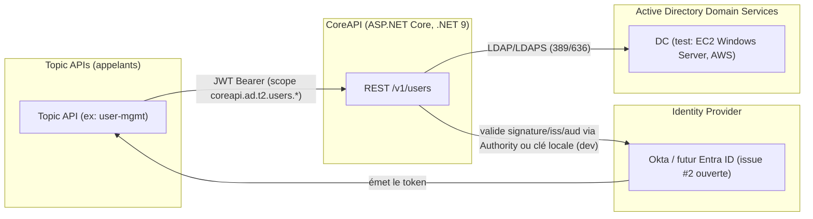

# Vue de contexte et frontières de confiance

*Reprise du contexte système établi dans la revue d'architecture/sécurité du 2026-07-19 (§3.1).*

## Frontières de confiance

1. **Topic API ↔ CoreAPI** (JWT Bearer) — non authentifié → 401, vérifié par test (`UsersControllerAuthorizationTests.List_without_a_token_returns_401`).
2. **CoreAPI ↔ AD DS** (LDAP/LDAPS, compte de service) — compte de service unique, aucune délégation de l'identité de l'appelant original vers AD.
3. **Opérateur ↔ AWS** (SSM Run Command, IAM) — test infra uniquement, voir [Spec 0](../../specifications/enablers/spec-0-test-demo-ad-infrastructure.md).

## Actifs et acteurs

Voir le modèle de menaces complet : [`../../assurance/threat-model.md`](../../assurance/threat-model.md).
