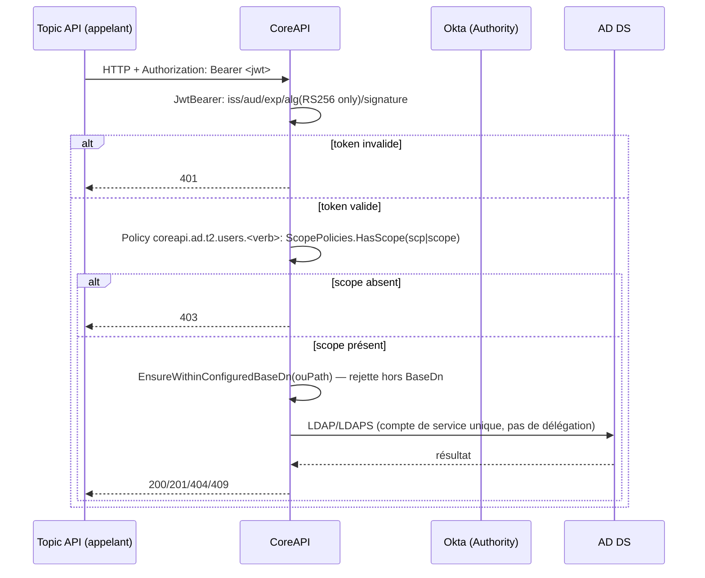

# Vue du flux d'identité et d'autorisation

*Reprise du flux établi dans la revue d'architecture/sécurité du 2026-07-19 (§3.3).*

## Ce qui est prouvé bout-en-bout par test HTTP réel

- Absence de token → 401
- Token valide mais scope non requis présent (autre ressource/verbe même tier) → 403
- Token avec le scope requis → non bloqué (200/201/etc. selon verbe)

## Écart de couverture connu

Aucun test ne monte un JWT avec un scope d'un **autre tier** (ex. `coreapi.ad.t1.users.read`) et ne l'envoie en HTTP contre un endpoint Tier 2 pour prouver que le câblage middleware réel produit bien 403 — la fonction de matching sous-jacente (`ScopePolicies.HasScope`) est prouvée correcte au niveau unitaire, mais pas ce chemin bout-en-bout précis. Voir [SEC-01](../../specifications/security/sec-01-authorization-by-client-ou-object-attribute.md) et le registre de risques (`R5`) dans [`../../assurance/reviews/2026-07-19-architecture-security-review.md`](../../assurance/reviews/2026-07-19-architecture-security-review.md).
