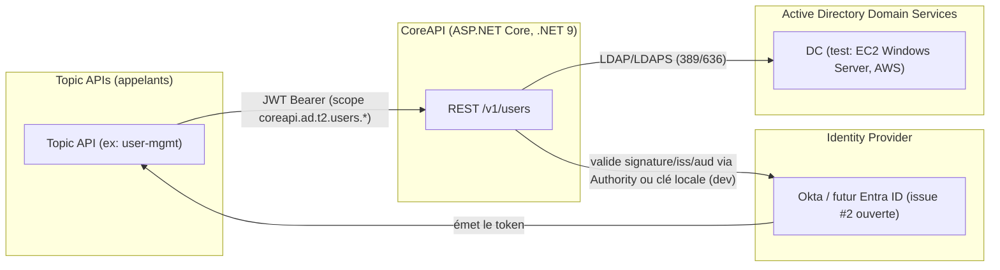
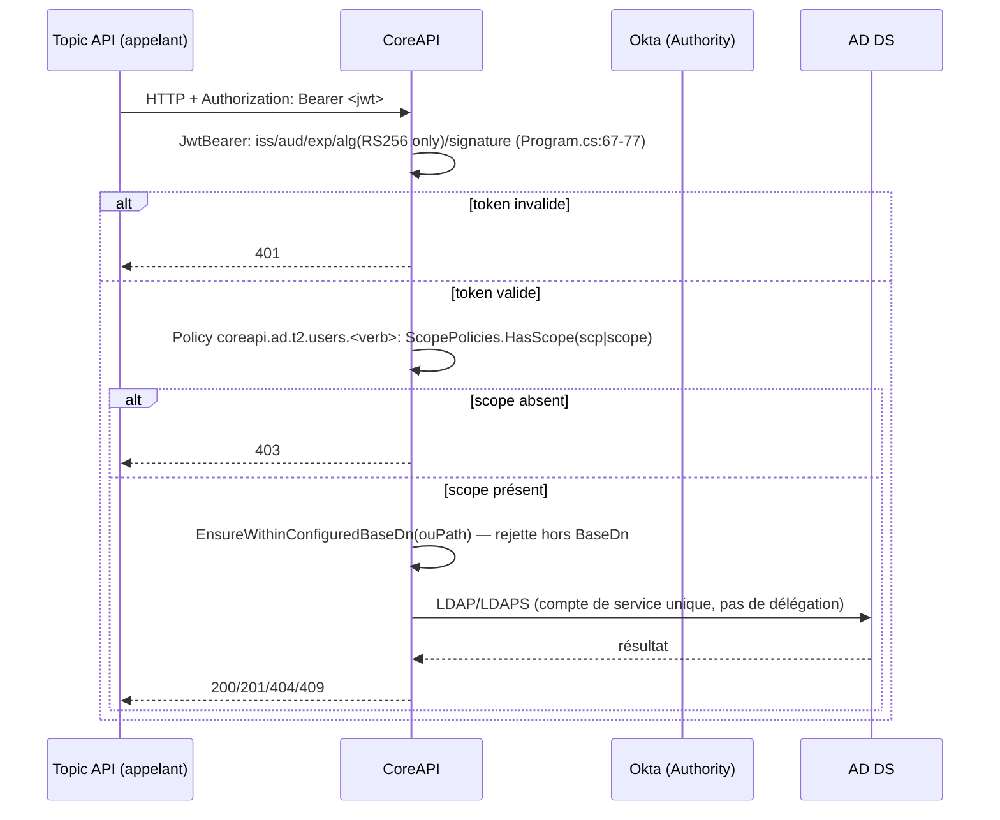

> **Ceci est la copie promue et canonique de cette revue.** La source originale, non modifiée, reste `.wip/results/2026.07.19.analyse.archi.dev.secu.md` (révision 2, historique de travail). Cette copie corrige un point d'attribution de preuve signalé par Philippe lors de la promotion (incrément EN-01) — voir « Note de promotion » ci-dessous. En cas de divergence, cette copie fait foi.

# Revue CoreAPI — architecture, sécurité, cohérence documentaire, trajectoire

Revue indépendante et contradictoire, méthode SPEC → PLAN → LIVRABLE → VERIFY → REVIEW → IMPROVE. Aucun fichier, branche, commit ou issue n'a été modifié pendant cette revue. Toute commande d'exécution locale (build, tests unitaires, `git`, lecture de fichiers) est identifiée comme telle ; aucune intégration AWS/AD réelle n'a été lancée.

## Note de promotion (EN-01, 2026-07-19)

Lors de la promotion de ce document vers `docs/`, Philippe a signalé une imprécision dans le §3.5 (révision 2) : le rapport n'y attribuait la dernière exécution réussie des tests (avant cette revue) qu'au commit `087137e`, un commit prédécesseur non fusionné et supplanté. Or **94 tests unitaires et 5 tests d'intégration avaient bien été exécutés avec succès avant cette revue sur le commit `78a45ac`** ("feat(authz): enforce tiered OAuth scopes on user endpoints"), ensuite fusionné dans `main` par la PR #5 (`1ff3df4`). Vérification effectuée à la promotion : `git log --pretty=%H -1 1ff3df4^2` confirme que `78a45ac` est le second parent du merge `1ff3df4` ; `git diff --stat 78a45ac main -- src tests` est vide, donc l'arbre `src/`+`tests/` de `78a45ac` est identique à celui de `main` actuel. Le §3.5 ci-dessous a été corrigé en conséquence — c'est la seule modification de fond apportée à la révision 2 lors de cette promotion ; tout le reste du document (registre de risques, matrice de conformité, backlog, etc.) est repris tel quel.

## Note de révision (2026-07-19, révision 2)

Ce document a été révisé une fois à la demande de Philippe. Treize corrections obligatoires ont été appliquées ; chaque passage modifié est marqué *(révisé — ...)* à l'endroit exact de la correction. Résumé des corrections (détail dans le tableau récapitulatif en toute fin de document) :

1. Distinction entre tests **découverts** (`--list-tests`) et tests **réellement exécutés** — §3.5.
2. « Autorisation/confinement par OU » remplacé par « confinement au sous-arbre `BaseDn` configuré » ; absence d'autorisation par client/OU/objet/attribut précisée — §3.4, §6 (R9).
3. Correction OWASP API1 (contrôle objet **partiel**, pas fort) — §5.
4. Correction du constat `AuthType.Negotiate` : ce n'est pas un bind anonyme, le risque porte sur l'identité d'exécution implicite — §4, §6 (R8).
5. Séparation stricte priorité de traitement / sévérité de sécurité / niveau de preuve — §6.
6. Réévaluation des sévérités Swagger, absence de CI, test HTTP inter-tier manquant — §6.
7. Reformulation du risque SSM (secret en clair dans le contenu de la commande et l'historique, pas dans le transport) et séparation du bind LDAP Basic sur 389 — §3.6, §6 (R2/R2bis).
8. Suppression de toute proposition faisant émettre des tokens par CoreAPI ; le composant de démo redevient un outil/service séparé — §9.
9. CI PR limitée au build + tests unitaires ; tests AWS dans un workflow séparé, manuel ou planifié — §6bis, §11.
10. ECS Fargate Linux reclassé comme cible candidate conditionnelle à un POC, pas une décision finale — §7, §8, Questions.
11. Distinction LDAP Simple Bind/LDAPS (obligatoire, port 389 interdit) vs Negotiate/SASL futur (signature + channel binding à évaluer) — §5, §6.
12. .NET 10 LTS confirmé comme cible ; distinction mise à jour corrective .NET 9 immédiate vs migration majeure .NET 10 — §10.
13. Externalisation du provisionneur repositionnée après définition de son contrat et son durcissement, avant réutilisation par d'autres projets — §8, §11, Questions.

## SPEC

- **Objectif** : évaluer l'état réel de CoreAPI (architecture, sécurité, cohérence doc/code, trajectoire) et produire un livrable exploitable pour décider de la suite (démo, durcissement, production).
- **Livrable** : ce fichier (copie promue ; source `.wip/results/2026.07.19.analyse.archi.dev.secu.md`).
- **Contraintes** : lecture seule ; toute affirmation sourcée (fichier:ligne, test, commande, commit) ; distinction stricte implémenté-vérifié / implémenté-non-vérifié / partiel / documenté seulement / décidé-non-implémenté / hypothèse / contradictoire / obsolète ; aucune branche vide présentée comme fonctionnalité.
- **Hors périmètre** : exécution des tests d'intégration AWS/AD réels ; provisioning AWS ; toute modification de code, doc, config ou historique Git.
- **Hypothèses explicites** : (H1) le HEAD de `main` au moment de la revue (`1ff3df4`) est l'état de référence unique — toute branche non fusionnée est traitée comme non livrée tant qu'un diff ne prouve pas le contraire. (H2) les dates de support .NET citées proviennent d'une vérification externe du 2026-07-19 (voir §12) et non de la mémoire du modèle. (H3) « aujourd'hui » = 2026-07-19 (fourni par le système).
- **Critères d'acceptation** : voir section « VERIFY » en fin de document.

---

## 1. Résumé exécutif

CoreAPI est aujourd'hui plus avancé que ce que sa propre documentation affiche. Le cœur technique — validation JWT, encodage anti-injection LDAP/DN, autorisation par scope, confinement au sous-arbre `BaseDn` configuré (aucune autorisation par client, OU, objet ou attribut n'existe encore, voir §3.4) — est **implémenté et vérifié par lecture de code**, et couvert par 99 cas de test **découverts** ce jour via `dotnet test --list-tests` (94 unitaires + 5 intégration ; voir §3.5 pour la distinction entre découverte et exécution réelle, et l'attribution correcte de la dernière exécution réussie au commit `78a45ac`, fusionné dans `main` via PR #5). C'est un socle sérieux pour une démo.

Mais trois familles de problèmes empêchent de qualifier CoreAPI de "prêt pour une démo sécurisée sans réserve" ou *a fortiori* de "prêt pour la production" :

1. **Des trous de sécurité concrets et corrigibles rapidement** : Swagger/OpenAPI est exposé sans condition d'environnement (`src/CoreApi/Program.cs:134-135`) ; aucune limitation de débit n'existe ; l'outillage de provisionnement du DC de test expose le mot de passe Administrator du domaine en clair dans le **contenu** de la commande SSM (le transport SSM lui-même reste chiffré en TLS) et, séparément, via un **Simple Bind LDAP non chiffré sur le port 389** lors du seeding en mode démo (deux constats distincts, voir §3.6/§6) ; aucune CI n'exécute les tests automatiquement.
2. **Une dérive documentaire réelle mais non malveillante** : le README affiche encore Spec 3 et Spec 4 comme "Pending" alors qu'elles sont fusionnées dans `main` depuis plusieurs commits ; deux documents d'architecture portent un statut "rien n'est implémenté" alors qu'ils citent eux-mêmes du code réellement fusionné ; la cible de déploiement AWS est contradictoire selon les documents (TBD vs Fargate décidé) ; le chemin de journal de décisions annoncé par `CLAUDE.md` (`.wip/adr/decisions-log.md`) n'existe pas.
3. **Une gouvernance Git locale plus faible que ce qu'elle prétend être** : `.git/info/exclude` n'exclut que `.wip.zip`, pas `.wip/` ni `.bkp/` — contrairement à ce que `CLAUDE.md` affirme ("exclu de Git via `.git/info/exclude`"). Un `git add -A` non réfléchi committerait aujourd'hui l'intégralité de `.wip/` et `.bkp/`, y compris une copie de sauvegarde antérieure du dépôt.

Aucune des deux branches repères (`feature/integration-record-cert-binding`, `feature/multi-instance-support`) ne contient de travail réel : les deux ont pour base de fusion le commit `052713c` (antérieur aux PR #4/#5) et leur diff contre `main` ne contient **que des suppressions** (32 fichiers, -2218/+279 lignes) — elles sont strictement en retard sur `main`, pas en avance. Ce sont des marqueurs d'intention, exactement comme décrit dans `authorization-and-access-model.md:206-210,421-430`.

## 2. Verdict global

**PASS WITH NOTES**

- Utilisable comme **démo technique interne** dès que le Swagger est mis sous garde d'environnement (§11) — aujourd'hui, non.
- Utilisable comme **POC sécurisé** après traitement des points P0 du backlog (§11).
- **Non prête pour la production** — écarts P0/P1 non traités, cible de déploiement non tranchée, DC de test non durci, absence de CI, gouvernance des secrets de test à corriger.

---

## 3. Architecture actuelle reconstruite

### 3.1 Contexte système (C4 niveau 1, texte)

Frontière de confiance n°1 : Topic API ↔ CoreAPI (JWT Bearer, non authentifié → 401 vérifié par test `List_without_a_token_returns_401`, `tests/CoreApi.UnitTests/Controllers/UsersControllerAuthorizationTests.cs:69-74`).
Frontière de confiance n°2 : CoreAPI ↔ AD DS (LDAP/LDAPS, credentials de service, actuellement compte de service unique — pas de délégation d'identité de l'appelant original vers AD).
Frontière de confiance n°3 (test uniquement) : opérateur ↔ AWS (SSM Run Command, IAM), voir §3.6.

### 3.2 Composants (implémenté et vérifié par lecture de code, `src/CoreApi/`)

| Composant | Rôle | Fichier |
|---|---|---|
| `Program.cs` | pipeline ASP.NET, JWT bearer, policies d'autorisation, Swagger, health check | `src/CoreApi/Program.cs` |
| `Controllers/UsersController.cs` | CRUD HTTP `/v1/users`, un `[Authorize(Policy=...)]` par verbe | `src/CoreApi/Controllers/UsersController.cs:27,46,65,85,103` |
| `Infrastructure/Authorization/ScopePolicies.cs` | format de scope `coreapi.ad.<tier>.<resource>.<verb>`, matching `scp`/`scope` | `src/CoreApi/Infrastructure/Authorization/ScopePolicies.cs` |
| `Infrastructure/LdapDirectoryConnection.cs` | connexion LDAP singleton, TLS, validation certificat/hostname, pagination, annulation | `src/CoreApi/Infrastructure/LdapDirectoryConnection.cs` |
| `Infrastructure/LdapFilterEncoder.cs` / `LdapDnEncoder.cs` | anti-injection RFC 4515 / RFC 4514 | idem |
| `Services/UserService.cs` | logique métier, confinement au sous-arbre `BaseDn` configuré (`EnsureWithinConfiguredBaseDn`) | `src/CoreApi/Services/UserService.cs:45,113,130-139` |
| `Infrastructure/ProblemDetailsExceptionHandler.cs` | mapping exceptions → RFC 7807, pas de fuite de message interne sur 500/503 | `src/CoreApi/Infrastructure/ProblemDetailsExceptionHandler.cs:9-33` |
| `tools/DevTokenMinter` | CLI de génération de JWT de test (profils valid/expired/wrong-aud/wrong-iss/unsigned/tampered) | `tools/DevTokenMinter/Program.cs` |
| `tools/setup-test-dc.ps1` + `TestInfrastructure/AdDcProvisionerFixture.cs` | provisionnement EC2 Windows + promotion AD DS pour tests d'intégration | voir §3.6 |

### 3.3 Flux d'identité et d'autorisation

**Point d'architecture notable** : CoreAPI n'effectue **aucune délégation d'identité** vers AD — toutes les opérations LDAP s'exécutent sous l'identité du compte de service configuré (`DirectoryConnectionOptions.ServiceAccountUser`), jamais sous celle de l'appelant JWT. L'autorisation est donc entièrement portée par le scope OAuth, pas par les ACL AD natives. C'est un choix cohérent avec un modèle "gateway", mais cela signifie que **CoreAPI est de facto le seul point de contrôle d'accès** — toute faille dans la vérification de scope équivaut à un accès direct AD avec les pleins pouvoirs du compte de service sur le sous-arbre configuré.

### 3.4 Autorisation — état réel vs modèle cible

- **Implémenté et vérifié** : scope exact par verbe/tier/ressource (`coreapi.ad.t2.users.{read,create,update,delete}`), un seul tier (T2) et une seule ressource (`users`) existent actuellement. Confirmé par `ScopePolicies.cs` et testé bout-en-bout HTTP (`UsersControllerAuthorizationTests.cs:97-125`, 2×5 cas).
- **Implémenté et vérifié** : confinement structurel au sous-arbre `BaseDn` configuré (`ouPath` ne peut pas sortir du `BaseDn` configuré, y compris contre une astuce de suffixe `OU=Users,DC=corp,DC=local,DC=evil` — `UserServiceTests.cs:54-75`). **Ce n'est pas une « autorisation par OU »** : il n'existe qu'un seul périmètre global (le `BaseDn` configuré), pas une matrice de permissions différenciée par OU. **Aucune autorisation par client, par OU individuelle, par objet ou par attribut n'existe aujourd'hui** — seuls le scope (tier/ressource/verbe) et ce confinement structurel unique déterminent l'accès.
- **Non implémenté** : autorisation au niveau attribut. Un porteur du scope `users.update` peut modifier tous les champs exposés (`Department`, `Manager`, etc.) sans granularité plus fine. Cohérent avec un seul tier aujourd'hui, mais devra être traité avant l'ajout de Tier 1/Tier 0.
- **Testé au niveau unitaire seulement, pas bout-en-bout HTTP** : confusion inter-tier. `ScopePoliciesTests.HasScope_false_when_scope_targets_another_tier` (unitaire pur) prouve que la fonction de matching rejette un scope `t1` face à une policy `t2` — mais **aucun test ne monte un vrai JWT scope T1 et ne l'envoie en HTTP contre un endpoint T2** pour prouver que le branchement middleware réel produit bien 403. Écart de couverture, pas une faille connue.
- **Décidé mais non implémenté** : les trois profils d'exécution complets (`user-identity-operations`, `service-identity-operations`, `control-plane-operations`), le JIT Control Plane, le suivi partagé `jti`, la liaison par certificat des fiches d'intégration, le routage dynamique par tier — tous décrits dans `authorization-and-access-model.md` mais absents du code (confirmé : aucune classe/fichier correspondant trouvé sous `src/CoreApi/`).

### 3.5 Tests — inventaire (découverte) et couverture (lecture de code)

Commande exécutée ce jour, **découverte seule, aucune assertion exécutée** : `dotnet test tests/CoreApi.UnitTests/CoreApi.UnitTests.csproj --list-tests` → **94 cas** ; `dotnet test tests/CoreApi.IntegrationTests/CoreApi.IntegrationTests.csproj --list-tests` → **5 cas**. Total **99**, réconcilié exactement avec le chiffre donné dans le mandat de cette revue (Fact + Theory/InlineData/MemberData expansés : 12+11+6+8+4+5+11+10+10+17 = 94 pour les tests unitaires).

**Ce que cette commande ne prouve pas, et qui doit être dit explicitement** : `--list-tests` énumère les cas sans exécuter leur corps ni leurs assertions. **Aucun test — unitaire ou intégration — n'a été réellement exécuté pendant cette revue.**

Les 94 tests unitaires et 5 tests d'intégration n'ont pas été réexécutés pendant cette revue. **Ils avaient cependant été exécutés avec succès avant cette revue**, sur le commit `78a45ac` ("feat(authz): enforce tiered OAuth scopes on user endpoints"), ensuite fusionné dans `main` par la PR #5 (`1ff3df4`, second parent = `78a45ac`). Vérification effectuée lors de la promotion de ce document : `git diff --stat 78a45ac main -- src tests` est vide — l'arbre `src/`+`tests/` de `78a45ac` est identique à celui de `main` actuel, donc cette exécution antérieure constitue une preuve valide pour le code aujourd'hui en `main`, pas seulement pour un état révolu. À distinguer d'un fait différent et non lié : un rapport antérieur (`.wip/results/test-count-forensic-audit.md`, session précédente) avait par ailleurs exécuté 90 tests sur le commit `087137e`, une branche prédécesseur non fusionnée et supplantée (`feature/spec-4-authz-retrofit`) — ce résultat concerne un état de code distinct et ne doit pas être confondu avec la preuve ci-dessus.

Couverture sécurité — **confirmée par lecture du code source des tests** :
- **Assertion présente dans le test tel qu'écrit** : rejet JWT `alg:none`, signature altérée, `iss`/`aud` erronés, expiration, algorithme hors liste blanche, clé non fiable (`JwtTokenValidationTests.cs`, 8 cas, tous au niveau `TokenValidationParameters`, pas nécessairement via HTTP direct pour chaque cas — seul "sans token" est également couvert par un test HTTP dédié, `UsersControllerAuthorizationTests.cs:69-74`).
- **Assertion présente dans le test tel qu'écrit** : échappement RFC 4515/4514 contre `* ( ) \` et NUL, y compris une tentative d'évasion vers une RDN sœur (`LdapDnEncoderTests.cs:44-55`).
- **Non trouvé** : test CRLF explicite dans un nom d'utilisateur/filtre. **Non trouvé** : test exerçant une véritable poignée de main TLS échouant fermée sur certificat invalide (seule la fonction de comparaison de nom d'hôte est testée isolément, pas le callback `RemoteCertificateValidationCallback` réel). Le sujet réel côté "bind" est l'identité d'exécution implicite via `Negotiate`, traité en §4 et §6/R8, pas un bind anonyme.
- **Non trouvé** (et absence confirmée dans le code par lecture) : rate limiting, suivi `jti`/anti-rejeu.
- Un ancien rapport (`tests/Codex.Analysis/spec-1-2-codex-review-findings.md`, 2026-06-15) avait signalé "LDAPS non imposé hors Development" comme lacune ouverte à l'époque — **cette lacune est désormais corrigée dans le code** (`Program.cs:122-124`, `.Validate(opt => builder.Environment.IsDevelopment() || opt.UseTls, ...)`, `.ValidateOnStart()` → échec au démarrage attendu), mais **le garde-fou lui-même n'a été ni exécuté ni testé automatiquement** pendant cette revue — implémenté par lecture de code, non vérifié par exécution.

### 3.6 Provisionnement du DC de test (implémenté et vérifié par lecture, non exécuté pendant cette revue)

- Mécanisme réel : **AWS Systems Manager Run Command** (`AWS-RunPowerShellScript`), **pas** de l'EC2 UserData — commentaire explicite dans le code : *"Don't use --user-data (EC2Launch v2 doesn't decode base64 properly)"* (`AdDcProvisionerFixture.cs:308`). Confirmé fonctionnel de bout en bout par `.claude/handoff/spec-0-status.md:10-15` (statut RESOLVED, 2026-07-16).
- Promotion AD réelle : `Install-ADDSForest` (module `ADDSDeployment`), **pas** `dcpromo.exe` (`AdDcProvisionerFixture.cs:635-677`).
- Security Group : ports 389/636/3389 ouverts au `/32` de l'IP publique de l'opérateur au moment de l'exécution (`setup-test-dc.ps1:406-412`), **pas** `0.0.0.0/0`. RDP (3389) est ouvert systématiquement, sans condition. Le nettoyage des règles pour d'anciennes IP (si l'opérateur change de réseau entre deux exécutions) n'est pas confirmé par le code lu — risque d'accumulation de règles, **non vérifié par exécution**.
- Identifiants : le mot de passe Administrator AD est saisi masqué puis reconverti en clair, écrit en clair dans `tests/CoreApi.IntegrationTests/appsettings.Development.json` (gitignoré, non chiffré au repos), puis inséré en clair **dans le contenu (payload) de la commande** envoyée via `ssm:SendCommand` (`AdDcProvisionerFixture.cs:659,664`). **Précision importante** : ceci ne signifie pas que le transport SSM est non chiffré — les appels d'API AWS (dont `ssm:SendCommand`) transitent en TLS comme tout appel d'API AWS. Le problème réel est que le secret est un **contenu en clair transporté puis persisté côté service** : il reste lisible dans l'historique des invocations de commande (`ssm:GetCommandInvocation`) et potentiellement dans CloudTrail/les journaux associés, pour quiconque dispose d'un accès en lecture à ces services dans le compte AWS. Aucun usage de Secrets Manager / Parameter Store SecureString.
- **Mode démo** (`-Mode demo`) : `KeepRunning=true` (le DC n'est plus arrêté après le test, fenêtre d'exposition réseau prolongée indéfiniment) et `SeedDemoData=true`.
- **Constat distinct, à ne pas fusionner avec le point SSM ci-dessus** : le seeding des objets de démo utilise un **Simple Bind LDAP (`AuthType.Basic`) sur le port 389, sans TLS**, avec les identifiants **Domain Administrator** (`AdDcProvisionerFixture.cs:899`). Un Simple Bind authentifié ne doit **jamais** transiter hors LDAPS ; le port 389 est à proscrire strictement pour tout bind porteur d'identifiants, quelle que soit la portée réseau (voir §5 pour la distinction Simple Bind/LDAPS vs Negotiate/SASL). Ici, c'est le protocole applicatif LDAP lui-même — pas le transport SSM — qui expose l'identifiant en clair sur le réseau.
- Aucune trace d'externalisation du provisionnement dans le code ou la doc (`.wip/docs/`) — mais **décidé** au niveau intention : issue GitHub ouverte **#3** *"Extraire l'outillage Spec 0 (provisioning DC AD DS) dans son propre repo"* (ouverte 2026-07-17). Statut : **décidé mais non implémenté**.
- **Aucune pipeline CI/CD n'existe** dans ce dépôt — pas de `.github/workflows/`, pas d'équivalent Azure/GitLab/Jenkins (recherche exhaustive, zéro résultat). En l'absence de CI, les 99 cas de test ne peuvent être exécutés que manuellement, par un développeur, sur son poste — cette revue n'en a exécuté aucun (voir §3.5) : ce constat porte sur l'absence de mécanisme automatique, pas sur une exécution réalisée pendant la revue.

### 3.7 Gouvernance de l'état local (`.wip/`, `.bkp/`) — écart vérifié

`CLAUDE.md` (racine) affirme : *"Cet état est local au repository et exclu de Git via `.git/info/exclude` (ajouté automatiquement par l'installateur)"*. Lecture de `.git/info/exclude` (13 lignes utiles) : seule l'entrée `.wip.zip` existe ; **aucune entrée pour `.wip/` ni `.bkp/`**. `git status` confirme : `.wip/results/` et `.bkp/` apparaissent bien comme fichiers non suivis (non ignorés). Un `git add -A`/`git add .` non vérifié committerait aujourd'hui l'intégralité de ces arborescences, y compris `.bkp/` qui contient une copie complète et antérieure du code source, des tests, et un fichier `dev-signing-key.private.pem` (clé de dev, sans valeur de production, mais dont la présence même dans un commit serait un mauvais signal). Ce fichier `.pem` particulier est protégé accidentellement par un `.gitignore` imbriqué (`.bkp/.gitignore:497`, copie de l'ancien `.gitignore` racine) — protection fortuite, pas garantie par conception.

**Classe** : contradictoire (doc vs état réel du dépôt).

---

## 4. Threat model (STRIDE)

**Actifs** : mot de passe du compte de service AD, clé de signature JWT/JWKS de l'Authority, données d'annuaire AD (PII : nom, email, manager), disponibilité du DC, intégrité des scopes/policies.
**Acteurs** : Topic API légitime (appelant normal), Topic API compromise, opérateur AWS (test infra), attaquant réseau externe, attaquant interne avec accès réseau au DC de test.
**Frontières de confiance** : Caller↔CoreAPI (JWT) ; CoreAPI↔AD (LDAP/LDAPS, compte de service) ; Opérateur↔AWS (IAM/SSM, test infra uniquement).

| STRIDE | Scénario | Contrôle existant | Contrôle manquant | Risque résiduel |
|---|---|---|---|---|
| **S**poofing | Token forgé/altéré | signature RS256 vérifiée, alg allow-list, `Unsigned_alg_none_token_is_rejected` testé | sender-constraining (mTLS/DPoP) — absent, cf. RFC 9700 | Faible (tier T2 seul, tokens courts — accepté comme risque à revisiter avant Tier 0/1) |
| **S**poofing | Identité d'exécution implicite non maîtrisée — **ce n'est pas un bind anonyme** : quand `ServiceAccountUser` est vide, la connexion utilise `AuthType.Negotiate` sans identifiants explicites — LDAP négocie alors l'identité **du processus/hôte** (Kerberos/NTLM intégré), pas un bind anonyme ni sans authentification | topologie domain-joined attendue par conception, mais non vérifiée par le code | aucun garde-fou explicite confirmant que la config `ServiceAccountUser` vide est intentionnelle et que l'identité implicite résolue à l'exécution est bien celle attendue | Moyen — dépend entièrement de la configuration/topologie de déploiement, pas une faille d'authentification en soi |
| **T**ampering | Injection LDAP/DN via champ utilisateur | `LdapFilterEncoder`/`LdapDnEncoder` RFC 4515/4514, testés unitairement | pas de test bout-en-bout via un vrai appel contrôleur avec charge malveillante ; CRLF non testé explicitement | Faible-Moyen — mécanisme solide, preuve d'intégration manquante |
| **T**ampering | Modification hors du tier autorisé (mass assignment) | DTOs à liste fermée de champs, `userAccountControl` jamais piloté par l'utilisateur | pas d'autorisation au niveau attribut | Faible aujourd'hui (un seul tier) |
| **R**epudiation | Absence de traçabilité des décisions d'autorisation (qui a eu 403, sur quel scope, quand) | logs `ILogger` ponctuels dans `LdapDirectoryConnection` (certificats, pagination) | pas de log d'audit structuré des décisions d'autorisation par requête ; pas de corrélation ; pas de SIEM (confirmé non implémenté, conforme au périmètre donné) | Moyen-Élevé pour une future prod |
| **I**nfo disclosure | Fuite de détail d'erreur backend | `ProblemDetailsExceptionHandler` ne renvoie pas `exception.Message` sur 500/503 | Swagger exposé sans condition d'environnement → schéma API complet, y compris annotations de scope requis, visible publiquement si déployé tel quel | **Élevé** |
| **I**nfo disclosure | Mot de passe Domain Administrator en clair dans le **contenu** de la commande SSM (R2) | aucun aujourd'hui | Secrets Manager/Parameter Store SecureString | **Élevé** (test infra, pas prod, mais mauvais gabarit à ne pas recopier) |
| **I**nfo disclosure | Mot de passe Domain Administrator transmis en clair via un **Simple Bind LDAP sur port 389** lors du seeding de démo (R2bis) | aucun aujourd'hui | LDAPS obligatoire pour tout bind porteur d'identifiants (voir §5) | **Élevé** (test infra, pas prod, mais mauvais gabarit à ne pas recopier) |
| **D**oS | Consommation excessive (recherches LDAP coûteuses, absence de throttling) | limite `MaxSearchResults`, pagination interne (page cookie 1000) | aucune limitation de débit HTTP | **Élevé** |
| **D**oS | DC de test laissé allumé indéfiniment en mode démo | aucun | arrêt automatique après un délai, ou fenêtre de démo bornée | Moyen |
| **E**levation of privilege | Confusion inter-tier via scope mal formé | test unitaire de matching prouve le rejet | pas de preuve bout-en-bout HTTP avec un vrai JWT T1 contre un endpoint T2 | Faible-Moyen (écart de preuve, pas de faille connue) |
| **E**levation of privilege | `ouPath` échappant au périmètre configuré | `EnsureWithinConfiguredBaseDn`/`IsDnWithinBaseDn`, testé y compris astuce de suffixe | — | Faible, bien couvert |

---

## 5. Matrice de conformité par référentiel

| Référentiel | Constat | Preuve |
|---|---|---|
| **Enterprise Access Model (Microsoft)** | Tiering formalisé en doc (`ad-ds-governance-model.md`), mais un seul plan (T2/Data-Workload) implémenté ; Control Plane / JIT non codé | `.wip/kb/active/security-architecture/enterprise-access-model.json` (modèle) vs `ScopePolicies.cs` (implémentation T2 seule) |
| **Zero Standing Access / RaMP** | Non implémenté au niveau exécution (pas de JIT, pas de compte à privilège temporaire) ; concept documenté | `zero-standing-access.json` ; absence de code correspondant sous `src/CoreApi/` |
| **Zero Trust (NIST 800-207)** | Partiel — chaque requête API est authentifiée/autorisée indépendamment de sa position réseau (bon), mais le DC de test s'appuie encore sur un contrôle d'accès réseau (Security Group /32) plutôt que sur une politique zero-trust de bout en bout | §3.6, `setup-test-dc.ps1:406-412` |
| **STRIDE** | Voir §4 | — |
| **OWASP API Security Top 10 (2023)** | API2 (Broken Authentication) : fort. API5 (Function-level authz) : fort, testé bout-en-bout. **API1 (Object-level authz) : partiel**, limité à un confinement structurel unique au sous-arbre `BaseDn` configuré, pas à une vérification d'autorisation par objet individuel ni à une différenciation par OU. API3 (Property-level authz) : absent. API4 (Unrestricted resource consumption) : **absent** (pas de rate limiting). API8 (Security misconfiguration) : **Swagger non gardé par environnement**. API9 (Improper inventory) : versionnement `/v1` seul, pas de politique de dépréciation documentée. | Program.cs, ScopePolicies.cs, `UserService.cs:130-139`, tests cités §3.4-3.5 |
| **OWASP ASVS 5.0** | V2 (Authentification) fort ; **V4 (Contrôle d'accès) partiel** (confinement structurel `BaseDn` oui, autorisation différenciée par objet ou par OU non, par attribut non) ; V7 (Gestion des erreurs) bon (RFC 7807, pas de fuite) mais audit logging faible ; V9 (Communications) fort pour le Simple Bind sur LDAPS (validation certificat/hostname stricte) — voir ligne LDAP ci-dessous pour la distinction par mécanisme ; V14 (Configuration) partiel (secrets test infra en clair, cf. §3.6/§6 R2/R2bis) | Program.cs, ProblemDetailsExceptionHandler.cs, LdapDirectoryConnection.cs |
| **AWS Well-Architected — Security Pillar** | IAM instance-role raisonnable (`AmazonSSMManagedInstanceCore`, un seul managed policy) ; permissions opérateur larges (acceptable pour un outil de test personnel, pas pour une prod) ; pas de Secrets Manager utilisé | §3.6 |
| **CIS Benchmarks Windows/DC** | **Non évalué** — durcissement du DC explicitement hors périmètre codé aujourd'hui, spec dédiée requise (demandé par Philippe) | non applicable dans le code actuel |
| **RFC 9700 (OAuth 2.0 Security BCP)** | Validation iss/aud/exp/alg conforme ; pas de sender-constraining — risque accepté explicite à formaliser | JwtTokenValidationTests.cs |
| **RFC 8725 (JWT BCP)** | Liste blanche d'algorithmes (RS256 seul), rejet `alg:none` : conforme | `JwtOptions.cs:26-30`, test `Unsigned_alg_none_token_is_rejected` |
| **RFC 9068 (JWT Profile OAuth2)** | Support des deux formes de claim scope (`scp` array et `scope` space-delimited) : conforme aux deux conventions | `ScopePolicies.cs:23-30` |
| **LDAP signing / channel binding / LDAPS** | **Simple Bind (mécanisme actuellement utilisé par CoreAPI et par le seeding de démo)** : doit obligatoirement passer par LDAPS (TLS), certificat validé, **port 389 interdit pour tout bind porteur d'identifiants**. Côté CoreAPI, LDAPS est imposé hors Development et la validation certificat/hostname est stricte et testée (`LdapDirectoryConnection.cs:44-45,53-96`) ; côté outillage de test, le seeding de démo **viole cette règle** (Simple Bind sur port 389, voir §3.6 et §6/R2bis). **Negotiate/SASL (non utilisé aujourd'hui en production — seulement un chemin de repli si `ServiceAccountUser` est vide, voir §4/R8)** : si ce mécanisme devait être adopté délibérément à l'avenir, la **signature LDAP (`Signing`) devient obligatoire** et le **channel binding est à évaluer selon le mécanisme SASL précis retenu** (Kerberos vs NTLM) — aucune des deux options n'est configurée aujourd'hui au-delà du TLS de transport, et la question ne se pose pas tant que seul le Simple Bind sur LDAPS est utilisé | `LdapDirectoryConnection.cs:44-45,53-96` ; `AdDcProvisionerFixture.cs:899` (violation constatée) ; question ouverte §"Questions" |

---

## 6. Registre de risques priorisé

| ID | Constat | Preuve | Référentiel | Niveau de preuve | Sévérité sécurité | Priorité de traitement | Correction recommandée | Test de preuve |
|---|---|---|---|---|---|---|---|---|
| R1 | Swagger/OpenAPI exposé sans garde d'environnement | `Program.cs:18,134-135`, aucun `IsDevelopment()` (grep exhaustif) | OWASP API8:2023 | Confirmé par lecture de code (absence de garde) | **Élevé aujourd'hui** (aucun déploiement partagé/public n'existe encore à ce jour) **→ devient Critique dès qu'un déploiement partagé ou public existe** | **P0** | Gate `IsSwaggerEnabled` (Development ou flag Demo dédié, échec au démarrage si activé ailleurs) | Test d'intégration : requête `/swagger` en environnement `Production` simulé → 404 |
| R2 | Le mot de passe Domain Administrator est inscrit en clair dans le **contenu** de la commande SSM Run Command (pas un défaut de chiffrement du transport, qui reste TLS) et reste visible dans l'historique des commandes/CloudTrail | `AdDcProvisionerFixture.cs:659,664`, `setup-test-dc.ps1:429,436` | CIS AD, secure-by-default | Confirmé par lecture de code ; non vérifié par exécution (aucun run réel pendant cette revue) | **Élevé** (test infra uniquement, mais gabarit dangereux s'il était recopié tel quel dans un contexte moins isolé) | **P0** | Secrets Manager/Parameter Store SecureString au lieu d'une interpolation en clair dans le payload de commande | Revue de code confirmant l'absence de toute valeur en clair dans le payload envoyé à `ssm:SendCommand` |
| R2bis | Le seeding des données de démo utilise un **Simple Bind LDAP (`AuthType.Basic`) sur le port 389, sans TLS**, avec les identifiants Domain Administrator | `AdDcProvisionerFixture.cs:899` | LDAP signing/LDAPS (§5), CIS AD | Confirmé par lecture de code | **Élevé** — un Simple Bind porteur d'identifiants ne doit jamais transiter hors LDAPS ; le port 389 est à proscrire dans ce cas, quelle que soit la portée réseau | **P0** | Basculer le seeding sur LDAPS (port 636) exclusivement | Test d'intégration confirmant qu'aucun bind authentifié n'est tenté sur le port 389 |
| R3 | Aucune limitation de débit | absence confirmée par grep `src/CoreApi` et `tests/` | OWASP API4:2023 | Absence confirmée par recherche exhaustive | **Élevé** | **P1** | Middleware `Microsoft.AspNetCore.RateLimiting` sur `/v1/*` | Test de charge simulée dépassant le seuil → 429 |
| R4 | Aucune CI/CD | absence de `.github/workflows` et équivalents (recherche exhaustive) | NIST CSF Govern/Protect | Absence confirmée par recherche exhaustive | **Moyen** (l'absence de CI n'est pas elle-même une vulnérabilité exploitable ; c'est un contrôle de gouvernance manquant qui augmente la probabilité que d'autres régressions, y compris de sécurité, passent inaperçues) | **P0** (priorité inchangée : peu coûteux à corriger, débloque tout le reste du backlog) | Pipeline **PR** limité au build + `dotnet test --filter Category=Unit` ; les tests AWS/intégration vivent dans un **workflow séparé, à déclenchement manuel ou planifié** | Exécution verte du pipeline PR sur une PR de test |
| R5 | Confusion inter-tier non prouvée bout-en-bout HTTP | `ScopePoliciesTests.cs:84-89` (unitaire) vs absence dans `UsersControllerAuthorizationTests.cs` | OWASP API5:2023 | Écart de preuve confirmé par lecture des tests existants — **aucune faille confirmée** : la fonction unitaire sous-jacente (`ScopePolicies.HasScope`) est prouvée correcte, c'est le câblage HTTP bout-en-bout qui n'est pas prouvé | **Moyen** (c'est un écart de couverture, pas une vulnérabilité constatée ; le risque réel serait une régression future non détectée, pas un accès non autorisé aujourd'hui) | **P0** (priorité inchangée : se fait naturellement en construisant le profil `demo-wrong-tier`, §9) | Ajouter un cas Theory avec JWT scope `t1` réel contre endpoint `t2` | Nouveau test `Action_with_wrong_tier_scope_returns_403` |
| R6 | RDP ouvert systématiquement sur le DC de test ; nettoyage des règles SG anciennes non confirmé | `setup-test-dc.ps1:409-412` | AWS Well-Architected Security | Confirmé par lecture de code (RDP) ; accumulation de règles = hypothèse non vérifiée par exécution | **Moyen** | **P1** | Retirer RDP au profit de SSM Session Manager (déjà utilisé partout ailleurs) ; auditer/purger les règles SG à chaque exécution | Script vérifiant qu'une seule règle /32 existe après exécution |
| R7 | Pas de signature/scellement LDAP explicite au-delà du TLS | `LdapDirectoryConnection.cs:44-45` | Recommandations Microsoft LDAP | Confirmé par lecture de code (absence de configuration) | **Moyen** — pertinent uniquement si Negotiate/SASL est activé un jour ; sans objet tant que seul le Simple Bind sur LDAPS est utilisé | **P2** | Décision explicite : LDAPS seul suffit-il, ou signing/sealing requis en plus si Negotiate/SASL est introduit ? | Question à trancher — voir section finale |
| R8 | Identité d'exécution implicite (`AuthType.Negotiate`) non maîtrisée si `ServiceAccountUser` est vide — LDAP négocie alors l'identité Kerberos/NTLM du processus/hôte, pas un accès anonyme | `LdapDirectoryConnection.cs:35-41` | Fail-secure | Confirmé par lecture de code ; comportement runtime non vérifié par exécution | **Moyen** | **P2** | Garde-fou explicite confirmant que cette configuration est intentionnelle et documentant l'identité attendue hors contexte domain-joined | Test simulant `ServiceAccountUser` vide hors Development |
| R9 | Pas d'autorisation par client, par OU différenciée, par objet ou par attribut — seul un confinement structurel unique (`BaseDn`) existe | Absence de code correspondant | Enterprise Access Model, ASVS V4 | Absence confirmée par lecture de code | **Moyen** (croîtra avec l'ajout de tiers) | **Plus tard** | À traiter avant Tier 0/1 | Spec dédiée |
| R10 | Connexion LDAP singleton unique, pas de reconnexion automatique après échec | `LdapDirectoryConnection.cs` (bind paresseux une seule fois) | Résilience | Confirmé par lecture de code | **Moyen** | **P2** | Ajouter logique de reconnexion/health-check actif | Test de coupure simulée |
| R11 | `/health` ne vérifie pas la connectivité AD réelle (health check par défaut, sans implémentation custom) | `Program.cs:43,142` — `AddHealthChecks()` sans `IHealthCheck` custom trouvé | Observabilité | Confirmé par lecture de code | **Moyen** | **P1** | `IHealthCheck` custom testant un bind/recherche léger sur AD | Test d'intégration coupant AD → `/health` doit refléter Unhealthy |
| R12 | `.wip/`/`.bkp/` non exclus par `.git/info/exclude` malgré ce qu'affirme `CLAUDE.md` | `.git/info/exclude` (13 lignes, seule `.wip.zip` listée) | Hygiène Git/secrets | Vérifié par exécution (lecture directe du fichier + `git status`) | **Moyen** | **P1** | Ajouter `.wip/` et `.bkp/` à `.git/info/exclude` (jamais un `.gitignore` versionné, conformément à la règle du projet) | `git status` après ajout : plus aucun fichier `.wip`/`.bkp` listé comme untracked |
| R13 | Documentation contradictoire (cible AWS incertaine ; Specs 3/4 "Pending" obsolète ; chemin `.wip/adr/` inexistant) | voir §7 | Cohérence/gouvernance | Vérifié par lecture croisée des documents | **Faible-Moyen** (risque de décision, pas de sécurité directe) | **P1** | Corrections listées en §7 | Relecture croisée post-correction |
| R14 | Pas de suivi `jti`/anti-rejeu, pas de sender-constraining | Absence confirmée | RFC 9700 | Absence confirmée par recherche exhaustive | **Info** (risque accepté à formaliser) | **Plus tard** | Décision explicite à consigner comme risque accepté | — |

### 6bis. Portée de la CI recommandée

Pour lever R4 sans reproduire les risques de R2/R2bis dans une pipeline automatisée :

- **Workflow déclenché sur chaque Pull Request** : `dotnet build` + `dotnet test --filter Category=Unit` uniquement. Aucun accès AWS, aucun secret AD, aucune exécution des 5 tests d'intégration. C'est le seul workflow qui doit tourner automatiquement et sans supervision.
- **Workflow séparé pour les 5 tests d'intégration** : déclenchement **manuel** (`workflow_dispatch`) ou **planifié** (cron peu fréquent), jamais automatique sur push/PR — ces tests provisionnent une ressource AWS réelle (§3.6) et doivent rester sous contrôle humain explicite. Les secrets AWS/AD nécessaires doivent être fournis via les mécanismes natifs de secrets de la plateforme CI (jamais en clair dans le workflow ni dans un log), idéalement via une fédération d'identité (OIDC) plutôt qu'une clé d'accès statique longue durée.
- Ce découpage est cohérent avec le mandat initial de cette revue, qui interdit tout provisioning/test AWS automatique non explicitement autorisé — la même prudence doit s'appliquer à toute automatisation future, pas seulement à cette revue elle-même.

---

## 7. Audit de cohérence documentaire

| Document | Affirmation | Preuve dans le code | État réel | Écart | Correction proposée |
|---|---|---|---|---|---|
| `README.md:145` | "3 — Pending — JWT authentication middleware" | commit `0f08fbf feat(spec-3): JWT Bearer authentication middleware`, fusionné avant `1ff3df4` ; `JwtTokenValidationTests.cs` (8 tests) | **Obsolète** | Doc en retard sur le code | Passer à "Done" |
| `README.md:146` | "4 — Pending — User CRUD" | commit `28291ce feat(spec-4)`, `UsersController.cs` complet, scopes appliqués (PR #5) | **Obsolète** | Doc en retard sur le code | Passer à "Done", ajouter mention des scopes tiered |
| `README.md` | aucune mention du nombre de tests | 94 unit + 5 integration **découverts** ce jour via `dotnet test --list-tests` (voir §3.5 pour l'attribution correcte de la preuve d'exécution antérieure) | Absent | Manque d'ancrage vérifiable | Ajouter une ligne "Tests: 94 unit / 5 integration (`dotnet test --list-tests`)" plutôt qu'un chiffre en dur qui se périme |
| `CLAUDE.md:41` | décisions loguées dans `.wip/adr/decisions-log.md` | `.wip/adr/` n'existe pas ; le vrai fichier peuplé est `.claude/memory/decisions-log.md` (19 lignes, 1 entrée, 2026-06-16) ; ce contenu a depuis été migré vers `docs/adr/decisions-log.md` (incrément EN-01) | **Contradictoire** | Chemin mort | Corriger le chemin documenté dans `CLAUDE.md` pour pointer vers `docs/adr/decisions-log.md` |
| `CLAUDE.md` (implicite) | état `.wip`/`.bkp` "exclu de Git via `.git/info/exclude`" | `.git/info/exclude` ne contient que `.wip.zip` | **Contradictoire** | Écart doc/état réel | Ajouter les entrées manquantes à `.git/info/exclude` (jamais de `.gitignore` versionné, cf. règle projet) |
| `.wip/docs/specs/spec-0-developer-tooling.md` (frontmatter) | `status: in-progress`, mécanisme DCPROMO via UserData | `.claude/handoff/spec-0-status.md` (status RESOLVED 2026-07-16) : UserData a échoué, mécanisme réel = SSM RunCommand + `Install-ADDSForest` | **Obsolète** | Doc jamais mise à jour après le pivot technique | Réécrire la section mécanisme, passer status à `done` |
| `.wip/docs/architecture/ad-ds-governance-model.md:7` | `status: design — rien n'est implémenté` | Le document lui-même cite `UserService.cs`, `EnsureWithinConfiguredBaseDn`, le retrofit Spec 4 comme existants | **Contradictoire** (auto-contradiction) | Statut de façade non mis à jour | Passer à `status: partially implemented`, préciser quel sous-ensemble |
| `.wip/docs/architecture/authorization-and-access-model.md:7` | `status: design — rien n'est implémenté` | Cite `Program.cs` DI réel, commits Codex déjà audités | **Contradictoire** (auto-contradiction) | idem | idem |
| `.wip/docs/architecture/authorization-and-access-model.md:266-268` | cible AWS = "ECS Fargate" **décidée** | `README.md:19`, `.wip/docs/coreapi.md:59`, `.wip/docs/coreapi.project-goal.md:25` disent tous "TBD (ECS/EKS/Beanstalk)" ; aucune preuve dans le code actuel (`LdapDirectoryConnection.cs:36,40` utilise encore `AuthType.Negotiate`/`AuthType.Basic`, pas de configuration domainless-gMSA) que le socle Fargate/gMSA domainless a été validé en pratique | **Contradictoire entre documents, et prématuré** | Un seul document affirme une décision qui n'est étayée par aucune validation technique dans le code ; **ECS Fargate Linux doit être traité comme une cible candidate conditionnelle à un POC** (authentification Kerberos/gMSA domainless via `credentials-fetcher`, compatibilité LDAPS depuis un conteneur Linux — non vérifiées), pas comme une décision finale entérinée | Mener le POC de validation technique, puis seulement à l'issue trancher explicitement (voir "Questions pour Philippe") et aligner les 4 documents sur le même statut ("candidate conditionnelle" ou "décidée", selon le résultat du POC) |
| `.wip/kb/index.md:9-11` | liste 3 thèmes disponibles (`ad-ds`, `coreapi`, `powershell`) | `.wip/kb/index.json` contient 11 thèmes, dont `security-architecture` (qui porte les deux modèles de gouvernance cités dans cette revue) | **Partiellement à jour** | Index non régénéré | Régénérer `index.md` depuis `index.json` |
| `.wip/docs/specs/spec-3-jwt-authentication.md:108-114` | "aucune action de contrôleur protégée n'existe encore" (gap connu) | Spec 4 a ajouté `UsersController` avec policies réelles | **Obsolète** | Gap comblé depuis, non noté | Ajouter une note de clôture datée |

**Documents à corriger (liste exacte)** :
1. `README.md` — tableau roadmap (L141-152) + ajouter section tests.
2. `CLAUDE.md` — chemin du journal de décisions (L41) et cohérence avec `.git/info/exclude` réel.
3. `.wip/docs/specs/spec-0-developer-tooling.md` — mécanisme de promotion AD + statut.
4. `.wip/docs/architecture/ad-ds-governance-model.md` — frontmatter `status`.
5. `.wip/docs/architecture/authorization-and-access-model.md` — frontmatter `status` + cible AWS (après décision).
6. `.wip/docs/coreapi.md` et `.wip/docs/coreapi.project-goal.md` — cible AWS (après décision, pour cohérence avec #5).
7. `.wip/kb/index.md` — régénération depuis `index.json`.
8. `.wip/docs/specs/spec-3-jwt-authentication.md` — note de clôture sur le gap "aucune action protégée".

*(Note de promotion : les Specs 0–10 elles-mêmes ont été reconciliées et versionnées sous `docs/specifications/` par l'incrément EN-01 — voir [`../../specifications/catalog.yml`](../../specifications/catalog.yml). Les corrections ci-dessus visent les documents sources sous `.wip/` et `README.md`/`CLAUDE.md` à la racine, qui restent inchangés à ce jour.)*

---

## 8. Trajectoire réelle du produit

**État présent** : gateway REST Tier 2 (utilisateurs standards) fonctionnelle, CRUD complet, JWT + scopes tiered vérifiés, anti-injection LDAP/DN vérifié, confinement au sous-arbre `BaseDn` configuré vérifié. Pas de rate limiting, Swagger non gardé, DC de test provisionné via SSM+`Install-ADDSForest` mais avec une lacune de gestion des secrets (R2/R2bis), aucune CI.

**Prochaine fondation obligatoire (avant Specs 5-8)** :
1. Gate Swagger par environnement (P0).
2. Rate limiting minimal (P0).
3. CI **PR limitée au build + tests unitaires** ; les tests AWS/intégration dans un workflow séparé, manuel ou planifié (P0, voir §6bis).
4. Corriger la gestion des secrets SSM (R2) et le bind LDAP non chiffré du seeding de démo (R2bis) — deux corrections distinctes (P0).
5. Combler l'écart de preuve inter-tier bout-en-bout HTTP (P0).
6. Évaluer par un POC, puis seulement ensuite trancher et aligner, la cible de déploiement AWS — **ECS Fargate Linux reste une cible candidate conditionnelle, pas une décision finale** (P1 — décision et validation technique, pas implémentation complète).

**Démo** : voir §11 — nécessite l'ajout d'un mode démo Swagger avec profils prédéfinis, sans jamais contourner `[Authorize]` ni la validation JWT réelle.

**Production** : au minimum, tous les P0/P1 du backlog (§11), une spec de durcissement du DC, l'externalisation du provisionnement séquencée après contrat+durcissement (issue #3, voir §8/§11), une décision de version .NET (§10), un plan d'observabilité/audit (aujourd'hui absent), et la levée des contradictions documentaires listées en §7.

Chantiers explicitement nommés par le mandat, statut réel :
1. Doc — **en cours via l'incrément EN-01**, corrections listées §7 et catalogue [`../../specifications/catalog.yml`](../../specifications/catalog.yml).
2. Version .NET — **mini-spec produite**, §10, décision à prendre par Philippe.
3. Durcissement DC — **non commencé**, spec dédiée requise (hors périmètre de cette revue).
4. Externalisation provisionnement — **décidé en intention (issue #3), non implémenté** ; à ne pas exécuter avant d'avoir défini le contrat du provisionneur (entrées/sorties, garanties d'idempotence, exigences de sécurité) et corrigé son durcissement (R2, R2bis, R6) — l'extraction vers un dépôt séparé et réutilisable par d'autres projets ne doit venir qu'**après**, pour ne pas propager les lacunes actuelles à un outil plus largement consommé.
5. Audit/observabilité — **non implémenté** (logs ponctuels seulement, pas de piste d'audit structurée).
6. Contrôle par client/OU/objet/attribut — **confinement structurel au sous-arbre `BaseDn` implémenté et vérifié** ; autorisation différenciée par client, par OU, par objet ou par attribut **non implémentée**.
7. Rate limiting — **non implémenté**.
8. Health/readiness AD — **health check générique présent, ne vérifie pas AD réellement** (partiel).
9. Secrets/identités techniques — **partiellement géré** (gitignore correct pour les vrais secrets d'app ; lacune confirmée côté outillage de test, §3.6/R2).
10. Stratégie de déploiement AWS — **contradictoire entre documents** ; ECS Fargate Linux est une **cible candidate conditionnelle à un POC de validation technique** (gMSA domainless, LDAPS depuis un conteneur Linux), pas une décision finale entérinée.
11. Multi-instance — **non implémenté**, branche marqueur seulement (`feature/multi-instance-support`, aucun contenu réel).
12. Specs 5-10 — **non implémentées** (aucun code correspondant trouvé).

---

## 9. Proposition Swagger de démonstration

**Contrainte non négociable** : CoreAPI **est et reste un resource server**. Aucune conception ci-dessous ne fait émettre, signer ou distribuer un jeton par CoreAPI lui-même (pas de nouvel endpoint de type token-issuer hébergé dans `CoreApi.csproj`/`Program.cs`). Le composant qui signe les jetons de démo (« DemoTokenIssuer ») doit rester **un outil ou service séparé**, distinct du pipeline CoreAPI, exactement comme `tools/DevTokenMinter` l'est déjà aujourd'hui (projet séparé, `tools/DevTokenMinter/DevTokenMinter.csproj`, jamais référencé par `CoreApi.csproj`).

### Comparaison des deux variantes demandées

| Critère | Variante 1 — étendre `DevTokenMinter` (CLI séparé) + copie manuelle du token dans Swagger | Variante 2 — DemoTokenIssuer séparé (petit service HTTP autonome) + auto-remplissage Swagger |
|---|---|---|
| CoreAPI reste resource server pur | Oui, par construction — aucun code ajouté à `CoreApi.csproj` au-delà de l'affichage | Oui, à condition que le DemoTokenIssuer soit un processus/déploiement strictement séparé de CoreAPI |
| Réutilise le pipeline JWT réel côté CoreAPI | Oui — mêmes classes `JwtBearer`, mêmes policies, validation inchangée | Oui, identique |
| Effort d'implémentation | Faible — `DevTokenMinter` a déjà les profils `valid/expired/wrong-audience/wrong-issuer/unsigned/tampered` (`tools/DevTokenMinter/Program.cs:54-63`) ; il manque juste des profils par *scope métier* (`demo-reader`, etc.) | Moyen-élevé — nouveau service HTTP à écrire, packager, isoler et sécuriser séparément de CoreAPI |
| Surface ajoutée côté CoreAPI | Minimale : une page Swagger personnalisée statique (liste de commandes + bannière), gérée par un flag d'affichage `DemoMode:Enabled` | Une page Swagger personnalisée qui appelle, en JavaScript côté navigateur, un service tiers distinct — aucun nouveau code serveur dans CoreAPI, mais un service de plus à exploiter et isoler |
| Confort utilisateur | L'opérateur exécute une commande CLI et colle le résultat dans le champ Bearer de Swagger UI (fonctionnalité native de Swagger UI) | Auto-remplissage du champ Bearer sans étape manuelle |
| Cohérence avec l'existant | Élevée — capitalise sur un outil déjà écrit, déjà séparé, déjà testé négativement | Plus de code neuf, plus de surface à isoler et à revoir |

**Recommandation : Variante 1**, étendue comme suit — c'est la solution la plus simple qui conserve le véritable pipeline de sécurité tout en garantissant que CoreAPI n'émet jamais de jeton, conformément à la contrainte du mandat. La Variante 2 reste une option de confort si l'auto-remplissage est jugé nécessaire, à condition que le DemoTokenIssuer soit déployé et isolé comme un service à part entière, jamais comme un endpoint de `CoreApi.csproj`.

### Conception recommandée (Variante 1)

1. Ajouter à `DevTokenMinter` (outil CLI **séparé**, hors du pipeline CoreAPI) des profils **métier** en plus des profils de robustesse déjà présents :
   - `demo-reader` → `coreapi.ad.t2.users.read`
   - `demo-user-operator` → `coreapi.ad.t2.users.read create update`
   - `demo-user-admin` → `coreapi.ad.t2.users.read create update delete`
   - `demo-denied` → un scope sans rapport (`coreapi.ad.t2.groups.read`)
   - `demo-wrong-tier` → `coreapi.ad.t1.users.read` (scope Tier 1 présenté à un endpoint Tier 2 — comble directement l'écart de test R5 signalé en §6)
   - `demo-expired` → jeton expiré (profil `expired` déjà existant, à réutiliser)
2. Côté CoreAPI, **aucun nouvel endpoint n'est ajouté**. Le seul changement est une personnalisation d'affichage de Swagger UI (page statique/`index.html` custom, ou `DocumentFilter` ajoutant un bloc `info.description`), active **uniquement** si `DemoMode:Enabled=true` (nouvelle option d'affichage, `false` par défaut, `ValidateOnStart()` qui **échoue au démarrage** si `DemoMode:Enabled=true` et `ASPNETCORE_ENVIRONMENT` n'est ni `Development` ni `Demo` — même schéma de garde-fou que celui déjà utilisé pour `DevSigningKeyPath`, `Program.cs:52-54`). Cette page affiche : la bannière **« DEMO — IDENTITÉS ET DONNÉES FICTIVES »**, et la liste fermée des six commandes `dotnet run --project tools/DevTokenMinter -- <profil>` à exécuter.
3. L'opérateur/démonstrateur exécute la commande CLI correspondant au profil souhaité, obtient un JWT signé par `DevTokenMinter` (avec un `Authority`/`Audience` de démo, distincts des vrais), et le colle dans le champ « Authorize » natif de Swagger UI. Aucune ligne de code serveur nouvelle côté CoreAPI ne traite, ne signe ni ne distribue ce jeton.
4. `jti` présent dans chaque jeton de démo (déjà trivial à ajouter dans `DevTokenMinter`, qui utilise `JwtSecurityTokenHandler`).
5. Aucune saisie libre de claims par l'utilisateur — uniquement une liste fermée de profils prédéfinis, exactement comme demandé.
6. Test obligatoire prouvant que `DemoMode:Enabled` (affichage) ne peut pas être activé en dehors de `Development`/`Demo` : reprendre le même schéma que le garde `DevSigningKeyPath` (`Program.cs:52-54`) — actuellement, cette classe de garde-fou n'a elle-même pas de test dédié (cf. §3.5/§6) : **il faudra ajouter ce test en même temps**, pas seulement pour le nouveau flag.

Ceci ne contourne à aucun moment `[Authorize]`, ne désactive aucune validation JWT, n'accepte aucun claim non signé, n'embarque aucune clé privée dans Swagger, **ne fait jamais émettre de jeton par CoreAPI lui-même** (le token est signé par l'outil `DevTokenMinter`, un processus entièrement séparé, jamais par CoreAPI ni par le navigateur), et reste désactivé par défaut avec échec au démarrage si mal configuré.

---

## 10. Mini-spec — révision de la version .NET

### Problème

CoreAPI cible `net9.0` partout (`src/CoreApi/CoreApi.csproj:4`, et tous les autres `.csproj` du dépôt). **.NET 9 est une version STS.** Vérification externe effectuée ce jour (2026-07-19) auprès de sources Microsoft officielles :

- **.NET 9** : sorti le 12 novembre 2024, support STS étendu à 24 mois (politique Microsoft mise à jour), **fin de support le 10 novembre 2026** — soit dans un peu moins de 4 mois à la date de cette revue.
- **.NET 8** : LTS, sorti le 14 novembre 2023, **fin de support également le 10 novembre 2026** (alignement des deux dates de fin de support annoncé par Microsoft).
- **.NET 10** : LTS actuelle, sortie le 11 novembre 2025, support jusqu'au 14 novembre 2028.

*Sources : blog officiel .NET (devblogs.microsoft.com/dotnet/dotnet-8-9-end-of-support/) et dotnet.microsoft.com/platform/support/policy/dotnet-core, consultés le 2026-07-19.*

**Constat clé** : rester sur .NET 9 n'achète aujourd'hui aucune marge de sécurité par rapport à un saut direct vers .NET 10 — les deux versions actuellement les plus proches (8 et 9) expirent à la même date. Migrer vers .NET 8 LTS n'aurait aucun sens (même échéance, version antérieure). La seule option qui prolonge réellement la fenêtre de support est **.NET 10 LTS**.

### Options

| Option | Avantage | Risque |
|---|---|---|
| Rester sur .NET 9 | Aucun effort immédiat | Fin de support dans ~4 mois ; à traiter de toute façon avant une mise en production durable |
| Migrer vers .NET 8 LTS | Rien — même échéance de fin de support que .NET 9, pour une version antérieure | Aucun bénéfice, effort de migration en pure perte |
| **Migrer vers .NET 10 LTS** | Support jusqu'à fin 2028, aligné avec le cycle LTS pair habituel (6, 8, 10) | Effort de migration à chiffrer ; compatibilité des dépendances à revérifier |

### Recommandation

**.NET 10 LTS est confirmé comme cible de migration majeure**, à planifier avant la mise en production et idéalement avant l'échéance de novembre 2026, une fois la démo stabilisée. Cette revue distingue explicitement deux actions qui ne doivent pas être confondues ni traitées avec la même urgence :

1. **Mise à jour corrective immédiate, dans .NET 9** : tant que .NET 9 reste supporté (jusqu'au 10 novembre 2026), appliquer les correctifs de service/sécurité au sein de la même TFM (`net9.0`) au fil de leur publication (version constatée ce jour : 9.0.18) est une action de routine, à faible risque, sans changement de TFM ni de comportement observable attendu — elle peut et doit continuer indépendamment de toute décision de migration majeure.
2. **Migration majeure vers .NET 10 LTS** : changement de TFM (`net9.0` → `net10.0`), revalidation des dépendances (`System.DirectoryServices.Protocols`, `Microsoft.AspNetCore.Authentication.JwtBearer`, `Swashbuckle.AspNetCore`), régénération des `packages.lock.json`, passage complet de la suite de tests. C'est un projet à part entière, à planifier et chiffrer, pas une mise à jour de routine.

Ne pas migrer dans le cadre de cette revue (hors périmètre, lecture seule) ; l'application de correctifs de service sur `net9.0` n'est pas non plus effectuée ici (aucune modification du dépôt).

### Impacts à vérifier (non exécutés dans cette revue — `non vérifié par exécution`)

- Compatibilité `System.DirectoryServices.Protocols` (actuellement `10.0.9` — le numéro de version du package n'est pas lié au TFM, à re-tester en conditions réelles contre un DC).
- `Microsoft.AspNetCore.Authentication.JwtBearer` (actuellement `9.0.17`) — vérifier la disponibilité de la ligne `10.x` correspondante.
- `Swashbuckle.AspNetCore` (actuellement `10.2.1`) — compatibilité OpenAPI/Swagger UI sous .NET 10.
- Tous les `packages.lock.json` (déterministes, `RestorePackagesWithLockFile=true`) devront être régénérés.
- Absence de CI aujourd'hui (§3.6) — la migration devra être validée manuellement faute de pipeline, ce qui est un risque en soi et renforce la priorité P0 "ajouter une CI" avant toute migration de version.
- Aucune image de conteneur n'existe encore dans ce dépôt (recherche effectuée, aucun `Dockerfile` trouvé) — la cible de conteneurisation future devra choisir une image de base `.NET 10`.

### Critères d'acceptation d'une future migration

- `dotnet build` et les 99 tests passent sous `net10.0` sans changement de comportement observable.
- Les 5 tests d'intégration passent contre un DC réel (à exécuter avec autorisation explicite, hors périmètre de cette revue).
- Aucune régression sur les garde-fous de démarrage (`ValidateOnStart` JWT/LDAP).

### Stratégie de retour arrière

Le TFM est un changement localisé aux `.csproj` ; un rollback consiste à revenir à `net9.0` avant l'expiration de son support (10 novembre 2026) si un blocage de compatibilité est découvert tardivement — d'où l'intérêt de ne pas repousser la décision trop près de cette échéance.

---

## 11. Backlog priorisé

**P0 (bloquant avant toute démo externe ou POC)**
- Gate Swagger par environnement, échec au démarrage si mal configuré (R1).
- Ajouter une CI **PR limitée au build + tests unitaires uniquement** (R4) — voir §6bis pour la portée exacte et la mise en garde contre l'automatisation des tests AWS.
- Corriger la gestion du secret Domain Administrator dans le contenu de la commande SSM du provisionneur de test (R2) **et**, séparément, basculer le seeding de démo sur LDAPS au lieu d'un Simple Bind en clair sur le port 389 (R2bis) — deux corrections distinctes, voir §6.
- Ajouter le test bout-en-bout HTTP de confusion inter-tier (R5) — se fait naturellement en construisant le profil `demo-wrong-tier` du §9.

**P1 (avant d'élargir au-delà de Tier 2)**
- Rate limiting minimal sur `/v1/*` (R3).
- Health check custom vérifiant réellement la connectivité AD (R11).
- Retirer/justifier RDP sur le DC de test, auditer l'accumulation de règles SG (R6).
- Ajouter le test manquant sur le garde-fou `UseTls` hors Development (§3.5).
- Corriger `.git/info/exclude` pour couvrir réellement `.wip/` et `.bkp/` (R12).
- Corriger les 8 documents listés en §7.
- Mener le POC de validation technique de la cible AWS (ECS Fargate Linux comme candidate conditionnelle, pas une décision entérinée) puis, seulement à l'issue, trancher et propager la décision dans les 4 documents concernés (R13).

**P2**
- Décision + option LDAP signing/channel binding explicite, uniquement si Negotiate/SASL est un jour retenu (R7).
- Garde-fou explicite sur l'identité d'exécution implicite via `Negotiate` quand `ServiceAccountUser` est vide (R8 — ce n'est pas un bind anonyme, voir §4/§6).
- Reconnexion/health-check actif de la connexion LDAP singleton (R10).
- Mini-spec de durcissement du DC (hors périmètre technique de cette revue) — **doit inclure la correction de R2/R2bis/R6**, puisque ce sont des lacunes du même outillage.
- **Définir le contrat du provisionneur de test** (entrées/sorties, garanties d'idempotence, exigences de sécurité) : préalable à toute externalisation, à traiter en même temps que le durcissement ci-dessus, avant l'étape suivante.

**Plus tard**
- **Externaliser le provisionnement du DC dans son propre dépôt** (issue #3 déjà ouverte) — **seulement après** que le contrat et le durcissement ci-dessus (P2) soient traités ; l'extraire avant introduirait un outil partagé et réutilisable par d'autres projets tout en conservant les lacunes de sécurité actuelles.
- Autorisation au niveau attribut (R9).
- Tiers 0/1, JIT Control Plane, suivi `jti` partagé, liaison par certificat, multi-instance (Specs 5-10) — aucun ne doit démarrer avant que les fondations P0/P1 soient traitées.
- Migration majeure vers .NET 10 LTS (§10) — à planifier en amont de novembre 2026, indépendamment du reste du backlog produit ; distincte des correctifs de service de routine sur .NET 9, qui peuvent continuer en parallèle.

---

## 12. Critères de qualification

**Démontrable** : Swagger gardé par environnement + mode démo (§9) livré et testé ; aucune donnée réelle accessible depuis l'environnement de démo.

**Sécurisée pour un POC** : tous les P0 traités, POC de validation technique de la cible AWS mené (ECS Fargate Linux restant une candidate conditionnelle tant que ce POC n'est pas concluant) et documents alignés sur son résultat, secrets de l'outillage de test corrigés (R2, R2bis).

**Prête pour la production** : POC + tous les P1 traités + spec de durcissement DC exécutée + provisionnement externalisé + CI complète (build, tests, scan de dépendances) + décision et exécution de la migration .NET 10 + plan d'observabilité/audit réel (pas seulement des logs ponctuels) + autorisation au niveau attribut si un tier plus sensible que T2 est ajouté.

---

## VERIFY

| Critère du mandat | Statut |
|---|---|
| Chaque constat majeur cite une preuve du dépôt | PASS |
| Aucune branche vide présentée comme fonctionnalité | PASS — `feature/integration-record-cert-binding` et `feature/multi-instance-support` explicitement démontrées vides (diff = suppressions uniquement, base = `052713c`) |
| Décisions futures séparées de l'implémentation | PASS |
| Contradictions documentaires identifiées | PASS — §7 |
| Risques classés | PASS — §6, 4 niveaux + Info |
| Recommandations testables | PASS — colonne "Test de preuve" en §6 |
| Mode démo ne contourne pas la sécurité réelle | PASS — §9, garde-fous explicites |
| Version .NET évaluée séparément | PASS — §10, aucune modification effectuée |
| Aucune modification faite dans le dépôt | PASS — cette copie est une promotion documentaire (`docs/`), la source `.wip/results/2026.07.19.analyse.archi.dev.secu.md` reste inchangée |
| Limites et vérifications non exécutées déclarées explicitement | PASS — voir mentions "non vérifié par exécution" en §3.5, §3.6, §10 |

**Verdict** : PASS WITH NOTES (voir §2).

Limites générales de cette revue : les tests d'intégration réels contre AWS n'ont pas été exécutés (interdit par le mandat) ; l'accumulation de règles de Security Group sur plusieurs exécutions n'a pas pu être vérifiée par exécution ; le durcissement CIS du DC n'a pas été évalué en détail (hors périmètre demandé, spec dédiée à faire) ; les dates de support .NET reposent sur une recherche web du jour, pas sur une connaissance figée du modèle.

---

## Questions nécessitant une décision de Philippe

1. **Cible de déploiement AWS** : `authorization-and-access-model.md` affirme "ECS Fargate" décidé ; trois autres documents disent "TBD (ECS/EKS/Beanstalk)" ; le code actuel ne contient aucune preuve que le socle gMSA domainless/conteneur Linux a été validé. Confirmez-vous que ECS Fargate Linux doit être traité comme **cible candidate conditionnelle à un POC de validation technique**, et non comme une décision entérinée, tant que ce POC n'a pas été mené ? Si un POC est validé, sur quel calendrier ?
2. **LDAP signing/channel binding** : le Simple Bind sur LDAPS (déjà implémenté et vérifié côté CoreAPI) est confirmé comme suffisant pour l'usage actuel. La question ne se pose que si `Negotiate`/SASL était un jour délibérément adopté (aujourd'hui seulement un chemin de repli non voulu, voir §4/R8) : dans ce cas, quel mécanisme SASL précis (Kerberos, NTLM) et quelle exigence de channel binding souhaitez-vous imposer ?
3. **Fenêtre de décision .NET** : confirmez-vous (a) la poursuite des correctifs de service de routine sur .NET 9 tant qu'il reste supporté, en parallèle de (b) une migration majeure planifiée vers .NET 10 LTS avec une échéance avant le 10 novembre 2026 (fin de support .NET 9) ?
4. **Provisionnement du DC de test** : l'issue #3 ("externaliser dans son propre repo") est ouverte mais non planifiée. Confirmez-vous le séquencement proposé — définir le contrat du provisionneur et corriger son durcissement (R2, R2bis, R6) **avant** l'extraction vers un dépôt séparé — plutôt que d'externaliser en premier ?

---

## Tableau récapitulatif des révisions (avant / après)

Ce tableau compare l'état de la revue avant (révision 1, 2026-07-19 matin) et après (révision 2, puis promotion) les treize corrections obligatoires de la révision 2, plus la correction d'attribution de preuve appliquée à la promotion. Les preuves originales (fichier:ligne, commandes exécutées, citations de code) sont toutes conservées dans le corps du document ci-dessus ; seules la terminologie, la classification et la structuration ont changé aux endroits indiqués.

| # | Sujet | Avant (révision 1) | Après (révision 2 / promotion) |
|---|---|---|---|
| 1 | Statut des 99 tests | Formulation ambiguë ("comptage exécuté ce jour"), risque de lecture comme "tests exécutés" | Explicitement **découverts** via `--list-tests` ; aucune exécution d'assertion pendant la revue ; **dernière exécution réussie correctement attribuée au commit `78a45ac`** (fusionné dans `main` via PR #5, arbre `src/`+`tests/` identique à `main` — vérifié à la promotion), distincte du résultat non lié obtenu sur le commit supplanté `087137e` |
| 2 | Terminologie OU | "Autorisation/confinement par OU" | "Confinement au sous-arbre `BaseDn` configuré" ; absence explicite d'autorisation par client/OU/objet/attribut |
| 3 | OWASP API1 | "fort au niveau OU" | "partiel" — confinement structurel unique, pas une autorisation objet différenciée |
| 4 | `AuthType.Negotiate` | Qualifié de "bind LDAP anonyme accidentel" | Reformulé en "identité d'exécution implicite" (Kerberos/NTLM du processus) — un bind Negotiate n'est pas un bind anonyme |
| 5 | Structure du registre de risques | Une seule colonne "Sévérité" mélangeant gravité et urgence | Trois colonnes séparées : **Niveau de preuve**, **Sévérité sécurité**, **Priorité de traitement** |
| 6a | Sévérité — Swagger exposé (R1) | "Critique" (plat) | "Élevé aujourd'hui → Critique si déploiement partagé/public" (conditionnel) ; priorité P0 inchangée |
| 6b | Sévérité — absence de CI (R4) | "Élevé" | "Moyen" (risque indirect de gouvernance, pas une vulnérabilité directe) ; priorité P0 inchangée |
| 6c | Sévérité — test HTTP inter-tier manquant (R5) | "Élevé" | "Moyen" (écart de preuve, aucune faille confirmée) ; priorité P0 inchangée |
| 7 | Risque SSM / LDAP démo | Un seul constat fusionné "SSM + bind LDAP non chiffré", risque de lecture comme "transport SSM non chiffré" | Scindé en **R2** (secret en clair dans le contenu de la commande et l'historique, transport TLS non mis en cause) et **R2bis** (Simple Bind LDAP non chiffré sur port 389, constat distinct) |
| 8 | Proposition Swagger de démo | Décrivait un endpoint CoreAPI émettant/signant des jetons de démo | CoreAPI reste strictement resource server ; le jeton est signé par `DevTokenMinter`, outil séparé, jamais par un endpoint CoreAPI |
| 9 | Portée de la CI recommandée | "CI exécutant les 99 tests sur chaque PR" (ambigu sur l'inclusion des tests AWS) | CI **PR limitée au build + tests unitaires** ; tests AWS/intégration dans un workflow séparé, manuel ou planifié (nouvelle §6bis) |
| 10 | Statut ECS Fargate Linux | Présenté comme une contradiction à "trancher" entre documents, sans qualifier la nature de la décision | Reclassé **cible candidate conditionnelle à un POC de validation technique**, pas une décision finale, dans les 4 documents concernés et le backlog |
| 11 | LDAP signing/channel binding | Traité comme une seule question ouverte générique | Distingué par mécanisme : **Simple Bind → LDAPS obligatoire, port 389 interdit** (règle immédiate) vs **Negotiate/SASL futur → signature + channel binding à évaluer selon le mécanisme** (question conditionnelle) |
| 12 | Recommandation .NET | "Migrer vers .NET 10 LTS" sans distinguer l'entretien courant de .NET 9 | .NET 10 LTS confirmé comme cible de **migration majeure** ; **mise à jour corrective de .NET 9** en parallèle explicitement identifiée comme une action distincte, de routine, à poursuivre tant qu'il reste supporté |
| 13 | Externalisation du provisionneur (issue #3) | Listée en P2 sans séquencement explicite avec le durcissement | Séquencée explicitement : définir le contrat + corriger le durcissement (R2/R2bis/R6) **d'abord** ; extraction vers un dépôt séparé **ensuite seulement**, avant réutilisation par d'autres projets |

Aucune preuve du corps du rapport (citations fichier:ligne, résultats de commandes, diffs Git) n'a été retirée ou affaiblie par cette révision ou cette promotion — seules la terminologie, la classification des risques, la séquence des recommandations, et l'attribution de la preuve d'exécution des tests (§3.5) ont été corrigées.
